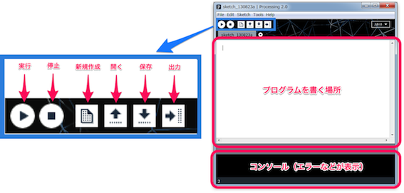
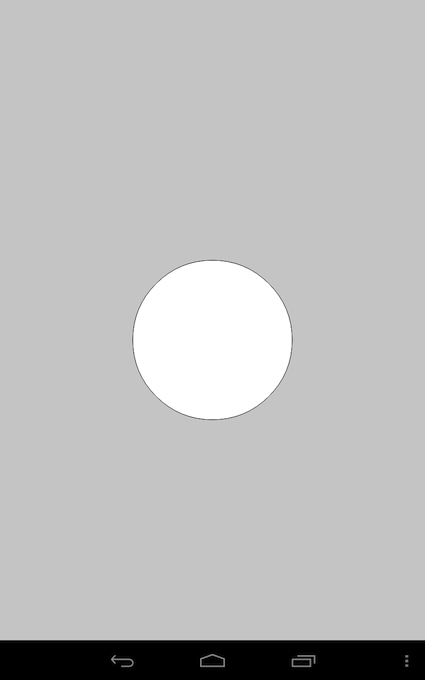
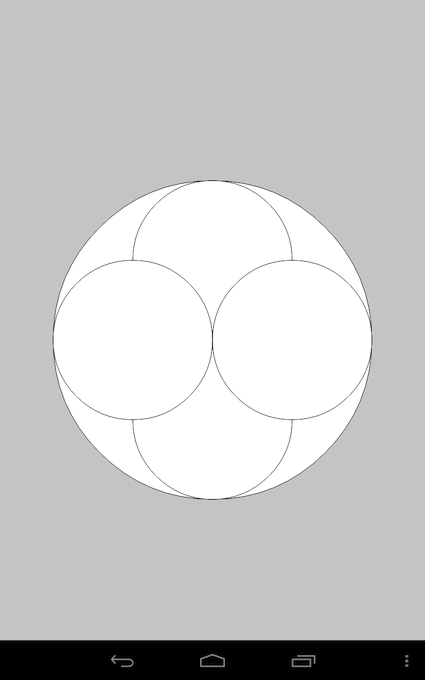
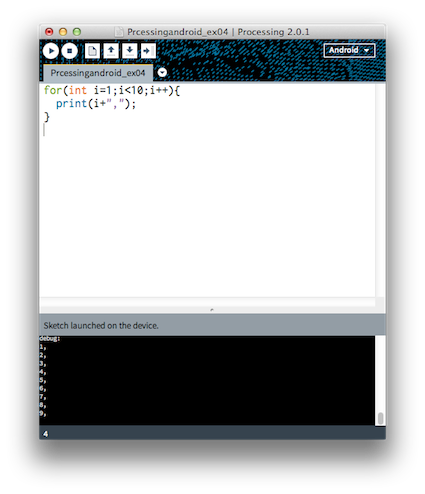
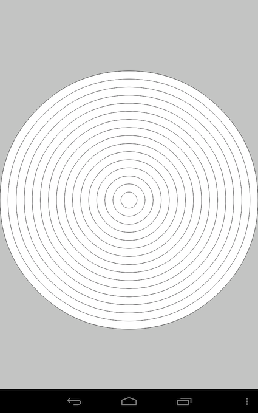

# 簡単にAndroidアプリを作ろう
2013/08/24  
サレジオ高専　情報工学科　清水哲也  
***
## 使うもの
- Processing 2.0
- Android端末（Nexus 7）




## Processingとは？
- MacOSX,Windows,Linuxで利用可能
- 無料で利用できる
- 電子アートとビジュアルデザインのためのプログラミング言語であり，統合開発環境
- 初心者がプログラミングを学習するのに適している
- 大学などでプログラミングの導入言語として利用されている


## Androidとは？
- googleが開発したスマートフォンやタブレット用OS（基本ソフト）
- ライセンスフリー
- 自分でカスタマイズができる
- 最近ではスマートフォン以外にマルチメディア機器にも搭載されている


## Processingを起動しよう


## Processingプログラミングの基本
- 実行の順序：上から順番に読み込まれていく
- 半角の英数字（全角はダメ）のみ使用すること
- 文末にはセミコロン“；”をいれる
- 色々な括弧が入れ子構造になっている
- 同じ括弧にかこまれている部分がひとつのブロック
- 最小単位→関数
- 関数名（引数）；

## 円を描いてみよう
- 円（楕円）を描く関数

```
ellipse(x座標, y座業, 横直径, 縦直径)
```

- 実際に書いてみよう！！

```
ellipse(400,640,300,300)
```

## 図


## 次の円はどうやって描く
- 次の円はどうやって描いたか考えてみよう！！


## 図

## 答えは！！
```
ellipse(400,640,600,600); //大きい円  
ellipse(400,490,300,300); //上の円  
ellipse(400,790,300,300); //下の円  
ellipse(250,640,300,300); //左の円  
ellipse(550,640,300,300); //右の円  
```

## 次はどうやって描く
- 次の画像はどうやって描いたか考えてみよう！！

## 図


## 答えは！！
```
ellipse(400,620,800,800);
ellipse(400,620,700,700);
ellipse(400,620,600,600);
ellipse(400,620,500,500);
ellipse(400,620,400,400);
ellipse(400,620,300,300);
ellipse(400,620,200,200);
ellipse(400,620,100,100);
```
  
## もっと楽にたくさんの円を描く方法はない？
- 同じ事を繰り返す為の関数があります
- for文の書き方

```
for(初期値; 条件式; 変化式) {
	実行しる処理;
}
```

- for文の例

```
for(int i=1; i<10; i++) {
	print(i+",");
}
```

## 実行例


- 初期値=1から条件式=10未満まで変化式=1ずつ足す

## for文を使ってみよう
- for文を使って次の円を描いてみよう！！


## 乱数
- 乱数を使ってみよう！！
- random関数（0から10までの乱数を生成）

```
random(10);
```

- random関数（10から1000までの乱数を生成）

```
random(10,1000);
```


## ランダムな場所と大きさで円を描く！！
- 乱数を使って場所や大きさの違った円をたくさん描こう！！
- random関数を使って

```
for(int i=0; j<10; i++) {
	ellipse(random(displayWidth),random(displayHeight),ramdom(200),random(200));
}
```

## 図

- ちょっとイメージとちがうかなぁ？？

## 楕円はなくて円がいい
- 乱数はとても面白いがちょっとイメージと違う
- ちゃんとした円で場所と大きさをランダムにするには？？

```
for(int i=0; i<100; i++) {
	float radius = random(10, 100);
	ellipse(random(displayWidth),random(displayHeight),radius,radius);
}

```

## 図


イメージどおり！！

## 円を動かしたい！！
```
int NUM = 100; //ボールの数
float[] x = new float[NUM];
float[] y = new float[NUM];
float[] xSpeed = new float[NUM];
float[] ySpeed = new float[NUM];
float[] radius = new float[NUM];

// 初期化関数
void setup() {
	noStroke();
	for (int i=0; i<NUM; i++) {
		x[i] = random(displayWidth);
		y[i] = random(displayHeight);
		xSpeed[i] = random(-10, 10);
		ySpeed[i] = random(-10, 10);
		radius[i] = random(20, 60);
	}
}

// メインループ
void draw() {
	background(0);
	for (int i=0; i<NUM; i++) {
		ellipse(x[i], y[i], radius[i], radius[i]);
		x[i] += xSpeed[i];
		y[i] += ySpeed[i];
		if (x[i] > displayWidth || x[i] < 0) {
			xSpeed[i] *= -1;
		}
		if (y[i] > displayHeight || y[i] < 0) {
			ySpeed[i] *= -1;
		}
	}
}
```

## 図
